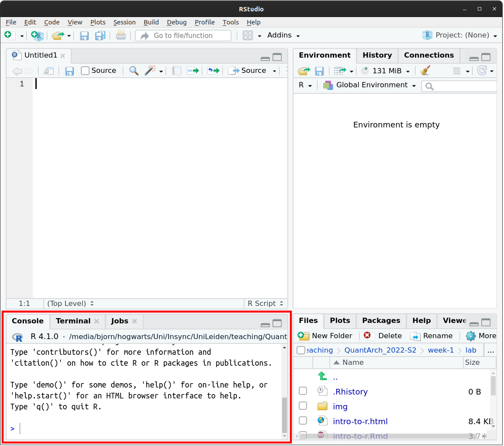
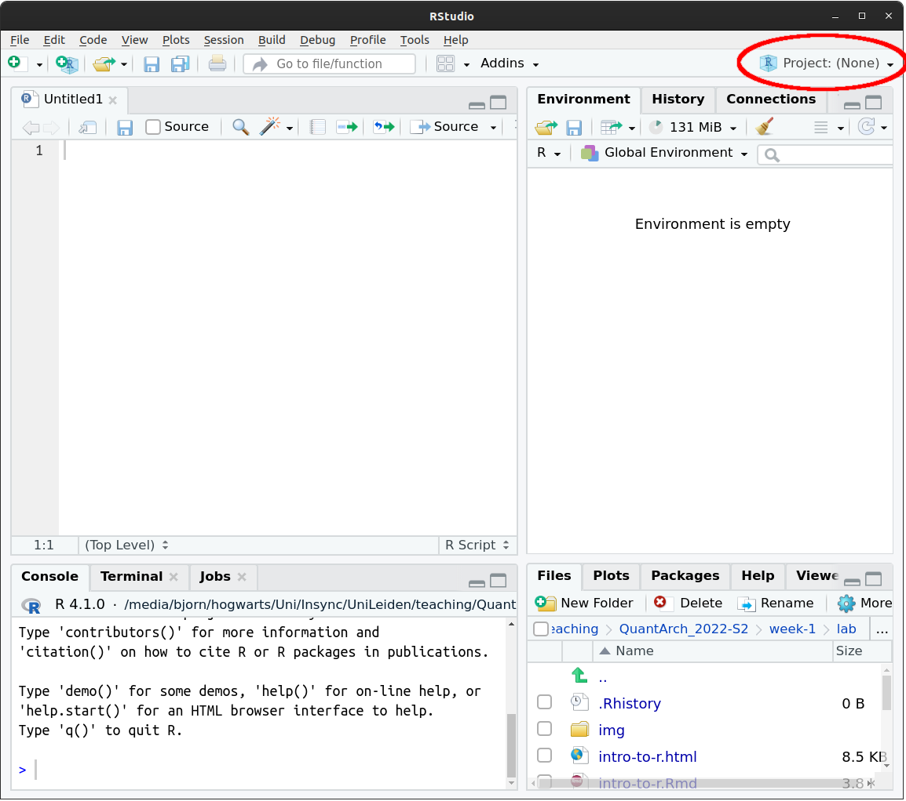
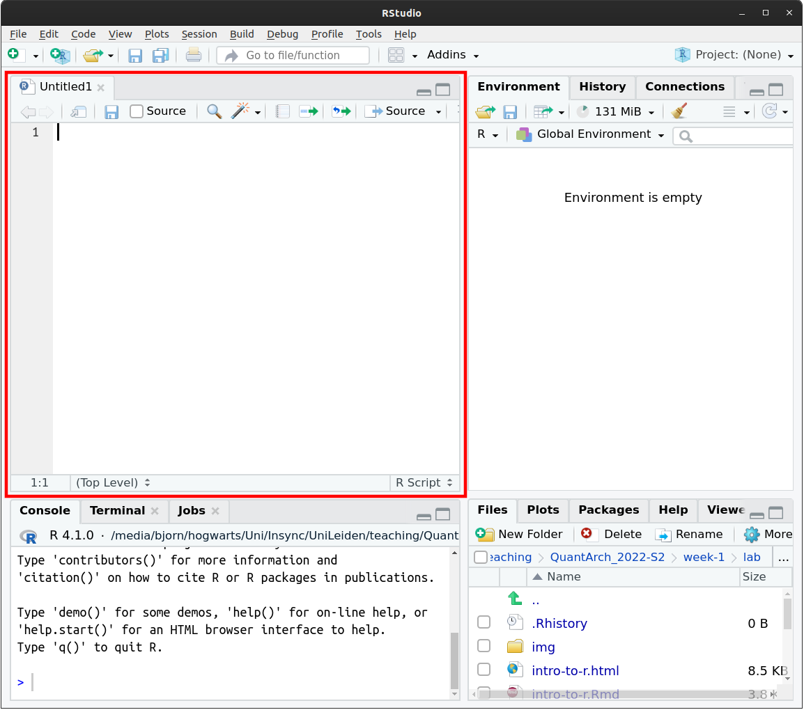
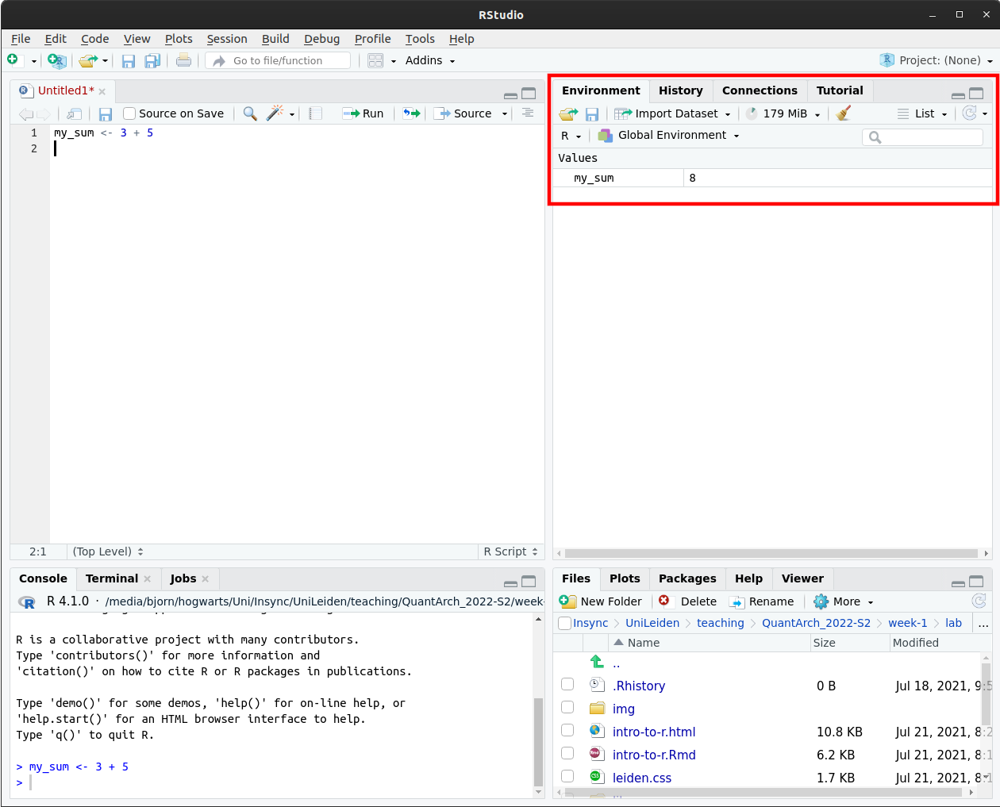

class: middle, left, inverse, title-slide

.title-left[
# Introduction to R

### Part 1: R and RStudio

#### QuantArch Week 1 | 07-02-2022
]

---
layout: true
<div class='footer'>
<span>Discover the world or something like that...</span>

</div>
---
class: right, bottom

```{r setup, include=FALSE}
options(htmltools.dir.version = FALSE)
```

```{r echo=FALSE}
xaringanExtra::use_progress_bar(color = "#2c712d")
```

## Who am I?


PhD student, Archaeological Sciences  
R user since 2017  

`r fontawesome::fa("twitter")` [OsteoBjorn](https://twitter.com/osteobjorn)  
`r fontawesome::fa("github")` [bbartholdy](https://github.com/bbartholdy)
`r fontawesome::fa("link")` [bjorn.rbind.io](https://bjorn.rbind.io)

---
class: center, middle, inverse

## R

### /'Arrrgh/

---
class: middle
background-image: url("assets/img/Rmeme.png")
background-position: right
background-size: 740px

.pull-left[
## Why R?

R is **free** and **open source**, 

created primarily for statistics.
]


---
class: middle

### RStudio

**RStudio** is an Integrated Development Environment (IDE) for R. You will only 
have to interact with RStudio, there is no need to ever open R, as it is integrated
into RStudio.

You will be able to interact with R in the **Console** pane in RStudio (left).

<!-- pic -->
.center[

<br>

**NOTE: Your console may take up the entire left side of RStudio; this is totally 
fine**
]
---
class: middle

### Basic usage

The console can be used for basic math. For example:

```{r}
3 + 5
```

--

Or

```{r}
12 / 7
```

--

Or even one of the dreaded internet equations

```{r}
8 / 2 * (2 + 2) # which we can solve without breaking the internet
```

---
class: middle

### Basic usage

When using the console, the `>` symbol indicates where you type your
code. The symbol will not be present where you have your output. Instead, you may 
see `[1]`, which indicates the first element of your output.

--

See what happens when we have an output with multiple elements; for example, we
can print the whole numbers from 1 to 42:

```{r}
1:42
```

--

If you don't see the `>` in the console, it may still be busy with
something. Wait until the symbol returns before you run more code.

--

If, instead, you see the `+` symbol, it means R is waiting for more
input. To get back to `>`, just press [Esc].

---
class: middle, inverse

## RStudio Projects

---
class: middle

### Super convenient!

**RStudio Projects** are a great tool to help you stay organised and allow you to
work with **relative paths** instead of **absolute paths**. 

```{r paths, eval=FALSE}
"~/Path/Is/Probably/Unique/To/You/QuantArch_2022/week-1" # absolute path
"./week-1" # path relative to QuantArch_2022
```

Combined with the **here** package you can always make sure the project root is 
the working directory, even when storing scripts and R Markdown files in folders within
the root directory (more on this later).

```{r eval=FALSE, echo=FALSE, fig.align='center', fig.cap="Image Credit: [Allison Horst](https://raw.githubusercontent.com/allisonhorst/stats-illustrations/master/rstats-artwork/cracked_setwd.png)"}
knitr::include_graphics("./assets/img/cracked_setwd.png")
```

```{r setwd-img, echo=FALSE, out.width=450, fig.align='center'}
knitr::include_graphics("./assets/img/cracked_setwd.png")

```

.footnote[ [Image credit: Allison Horst](https://github.com/allisonhorst/stats-illustrations) ]
---
class: middle

### Yes yes, let's get started already!

Create a new project in the top right corner of RStudio:

- Project: (None) > New Project... > New Directory > New Project

You can call the project QuantArch_2022 (or something like that)

Once the project is created, a fresh RStudio environment will open.

---
class: middle

### Project Organisation

When you open your project, you will start in the project **root directory**.
--
 This is where the relative paths for the project begin.
 
Within the project root, we'll make some folders called `data` and `scripts`.
This can be done in the lower right pane. Select the **Files** tab and 
then click on **New Folder**.

We can also do this from the **Console**:

```{r dirs, eval=FALSE}
dir.create("scripts")
dir.create("data")
# or
sapply(c("scripts", "data"), dir.create)
```

---
class: middle

.pull-left[
### Did I mention convenience?

Using a Project also allows you to conveniently pick up where you left off.

When you want to continue your work in the next lab, 

you can select your project 
from the drop-down menu in the top right corner.
]

.pull-right[

]
---
class: middle, inverse

## R Scripts

---
class: middle

.pull-left[
### Learning good (enough) practice

The best way to work with R is using **scripts**. 

This way you will have a record of
everything you have done, which is convenient and reproducible.

To open a new R Script: File > New File > R Script

An empty R Script will show up in the **Source** pane.
]

.pull-right[

]

---
class: middle

### Let's write some code!

For now, we can enter the calculations from earlier:

```{r eval=FALSE}
3 + 5
12 / 7
8 / 2 * (2 + 2)
```

You can run a line of code with [Ctrl] + [Enter] on Linux and Windows, and 
[Cmd] + [Enter] on Mac. The output will show up in the **Console** pane.

```{r echo=FALSE}
3 + 5
12 / 7
8 / 2 * (2 + 2)
```

You can run the whole script with [Ctrl] + [Alt] + [R] on Linux and Windows, and 
[Cmd] + [Alt] + [R] on Mac.

You can also find these and others in Code > Run Region > ...

---
class: middle

### Annotation, annotation, annotation...

You can add comments to an R Script with the 'hashtag', `#`. Anything written after this will not be executed.

```{r script-comment}
# Some very basic calculations
3 + 5
12 / 7 # although this one I can't actually do in my head...
8 / 2 * (2 + 2)
```

This is a good way to let others (and yourself) know what's going on in your 
script; otherwise...

---
background-image: url(assets/img/organize.jpg)
background-size: 580px
---
class: middle

### (Smooth) Operators

R has the following operators (non-exhaustive):

| operator | function |
|---|---|
| `+` | addition |
| `-` | subtraction |
| `*` | multiplication |
| `/` | division |
| `^` or `**` | exponentiation/order |
| `()` | brackets |
| `%%` | modulus |

---
class: middle

### Storing objects

So far, none of our code output has been stored/saved, i.e. if we wanted to
recall the calculation answers, we would have to run the code again.

--

To store an object in your **Global Environment**, use the assignment operator,
` <- `, with the name of the object on the left and the values on the rights.

--

When naming an object, it is important to consider the following:

- Must only contain alphanumerics, decimal point `.`, or, underscore `_`
  + must start with a letter
- should make sense to what you are storing
- should NOT interfere with any predefined R objects
  + knowing what these are comes with experience

---
class: middle

.left-code[
### More storing objects

```{r}
my_sum <- 3 + 5
# call it 'my_sum' because 'sum' is a predefined R object (function)
```

When you store an object, you won't get any output in the console.

Instead, the object will show up in your **Global Environment** pane.
]
.right-plot[

]

---
class: middle

### You guessed it, more storing objects

You can then call the output by entering the name of the object in the console
(or script), or using the `print` function,

```{r}
my_sum
print(my_sum)
```

--

and perform further operations on the object:

```{r}
my_sum * 2
```

--

The real benefit of storing an object is with larger data types and functions.

---
class: middle

### Final notes on objects

You can change an object by overwriting it with a new value:

```{r}
my_sum <- my_sum * 2
my_sum # show new value of object
```

You can remove objects with the `rm()` function by entering the name of the
object:

```{r eval=FALSE}
rm(my_sum)
```

Or remove everything from your environment (which can be useful if you are 
testing whether or not an R Script can run from scratch):

```{r}
rm(list = ls()) # ls() is a function that lists everything in your environment
```

---
class: middle, inverse

## Break
