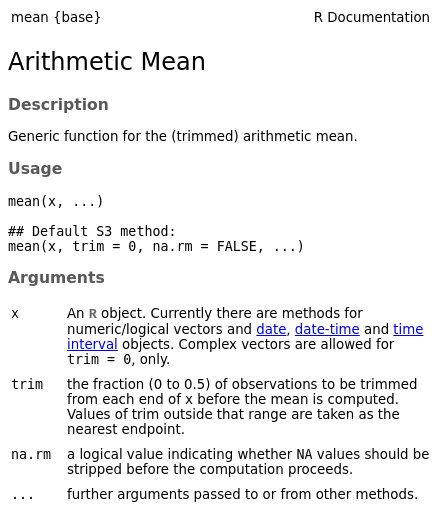

class: middle, title-slide, inverse

.title-left[
# `r rmarkdown::metadata$title`

### `r rmarkdown::metadata$subtitle`

#### QuantArch Week 1 | 07-02-2022
]

---
layout: true
class: middle, left
<div class='footer'>
<span>Discover the world or something like that...</span>

</div>
---
class: inverse

```{r echo=FALSE}
xaringanExtra::use_progress_bar(color = "#2c712d")
```

## Functions, data structures, and data types in R

---

### Functions

Usually containing a series of commands to automate a process.

We have already been introduced to a couple of built-in R functions 

- `rm()`
- `print()`

These performed specific **functions** when we gave them an object,

i.e. remove or print the given object.

---

### Anatomy of a function

A function can be called with the function name, and **input arguments** within 
the brackets:

`> example_function(arg_1 = some_argument, arg_2 = some_other_argument)`

--

This will then provide some sort of output/result (if it worked...)

You can save the output of a function to an object, 

just like the calculations from before
the break

---
class: middle

### Anatomy of a function

I wouldn't recommend looking inside a function...

--

```{r eval=FALSE}
median
```

```{r echo=FALSE}
stats:::median.default
```

---
class: middle

```{r xaringanExtra-freezeframe, echo=FALSE}
xaringanExtra::use_freezeframe()
```

### Anatomy of a function

I wouldn't recommend looking inside a function...

.center[  ]

---
class: middle

### Example functions

```{r}
my_numbers <- c(1:10) # start by creating a vector
my_numbers
```

--

```{r}
mean(x = my_numbers) # functions will often have obvious names...
```

--

```{r}
sum(x = my_numbers) # see what I mean?
```

--

In these functions, the first argument (`x`) is a vector. As long as you put 
arguments in the correct order, you don't need `x = `

```{r}
mean(my_numbers) # it assumes I mean x = my_numbers
```

---

.pull-left[
### Help

> *Help will always be given in R to those who ask for it.*

> Dumbledore (paraphrasing, again...)

<br>

To see which arguments a function requires

or to get additional help for a function

just type the name of the function preceded by `?`

```{r eval=FALSE}
?mean
```
]

--

.pull-right[

]

---
class: middle

### Basic data structures in R

| Data type | Explanation |
|---|---|
| vector/array | a series of values, which can be numeric, logical, or strings |
| matrix | a table of the same type of values, e.g. all numeric |
| data frame | a table with different types of values. Can combine strings and numbers |
| list | a series of data types. Can combine vectors, matrices, and data frames |

---
class: middle

### Data structures with examples

```{r include=FALSE}
vect <- c(1, 2, 5.5, TRUE, "random string")
m <- matrix(1:12, nrow = 3)
datf <- data.frame("names" = c("Arthur Dent", "Ford Prefect", "Trillian"), 
           "occupation" = c("???", "Researcher", "Astrophysicist"),
           "coolness" = c(3, 2, 1))
```

**Vector**

```{r}
c(1, 2, 5.5, TRUE, "random string")
```

--

**Matrix** `r emo::ji("sunglasses")`

```{r}
matrix(1:12, nrow = 3)
```

---
class: middle

### Data types with examples, the sequel

**Data frame**

```{r}
data.frame("names" = c("Arthur Dent", "Ford Prefect", "Trillian"), 
           "occupation" = c("???", "Researcher", "Astrophysicist"),
           "coolness" = c(3, 2, 1))
```

---
class: middle

### Data types with examples, the sequel, part 2

**List**

```{r}
# I cheated and stored the objects in advance (i.e. vect, m, datf)
list("vector" = vect, "matrix" = m, "data_frame" = datf)
```

---
class: middle, inverse

### Exercises

#### Atomic R object types

| typeof() | mode() |
|----------|--------|
| logical  | logical |
| integer  | numeric |
|  double  | numeric |
| complex  | complex |
| character| character |

Here are some examples of predefined operators in R:

`FALSE`, `NA`, `NaN`, `NULL`, `TRUE`

Use the `typeof` and `mode` functions to determine what category these operators
belong to.

---
class: middle, inverse

### Exercises

#### Solution

```{r include=FALSE}
type_of <- c("logical", "integer", "double", "complex", "character")
mode_of <- c("logical", "numeric", "numeric", "complex", "character")
knitr::kable(data.frame("typeof" = type_of, "mode" = mode_of))
```

| typeof() | mode() |
|----------|--------|
| logical  | logical |
| integer  | numeric |
|  double  | numeric |
| complex  | complex |
| character| character |

`TRUE`, `FALSE`, `NA`: logical

`NaN`: numeric, double

`NULL`: NULL

---
class: middle, inverse

## Exercises

Create and store a vector with the values `1.5`, `FALSE`, `"universe"`, `NA`.

Use the `length` function to compute the number of elements in the vector, 
and use `typeof` to see the type of the created object.

--

### Solution

```{r}
my_vector <- c(1.5, FALSE, "universe", NA)

typeof(my_vector)
```

A single vector can only contain one atomic object type, so it converted all
elements to `"character"`.

character > double > integer > logical

---
class: middle

### Vectors

We're going to dive into vectors in a little more detail.

There is a difference in vector definitions across the sciences.

In computer science (most relevant here), it is a one-dimensional array that 
we can use to store values/data.

.center[  ]

---
class: middle

In R, we create a vector using the `c` function.

Let's create and print a vector with a series of values:

```{r}
artefacts <- c("Sankara Stone", "Ark of the Covenant", "Holy Grail", "Crystal Skull", "Sankara Stone")
artefacts
```

--

This will of course be a character vector with five elements.

```{r}
typeof(artefacts)
length(artefacts)
```

---
class: middle

We can also create a logical vector:

```{r}
boolean <- c(TRUE, TRUE, FALSE, TRUE)
boolean
```

--

```{r}
typeof(boolean)
length(boolean)
```

This is also known as a 'Boolean' vector (and is great for indexing).

---
class: middle

What happens if we convert this to a numeric vector and a character vector?

--

```{r}
as.numeric(boolean)
as.character(boolean)
```

--

**Note:** The predefined operators (e.g. `FALSE`, `NaN`, etc.) lose their special
properties when converted to a character.

.center[  ]

---
class: middle, inverse

## Exercises

What type of object do you think the following vectors will be?  
Use the `typeof` or `class` function to check.

```{r}
vector_1 <- c(1, 3, "f", 2)
vector_2 <- c(4, TRUE, 5, 1)
vector_3 <- c("life", "universe", "everything", FALSE)
vector_4 <- c(3, 1, 4, 1, "5")
```

**Reminder:** Vectors can only hold one data type. Priority for vector conversion:

character > double > integer > logical

---
class: middle, inverse

### Solution

```{r}
class(vector_1)
class(vector_2)
class(vector_3)
class(vector_4)
```

---
class: middle, inverse

## Exercises

What happens if we combine `vector_2` and `vector_3`?  
**Hint:** The `c` function can also combine vectors.

```{r}
vector_1 <- c(1, 3, "f", 2)
vector_2 <- c(4, TRUE, 5, 1)
vector_3 <- c("life", "universe", "everything", FALSE)
vector_4 <- c(3, 1, 4, 1, "5")
```

--

### Solution

```{r}
c(vector_2, vector_3)
```

What happened to the `TRUE` entry in `vector_2`? `r emo::ji("shrug")`

---
class: middle

### Missing values

Missing values in R, are represented with `NA`.

```{r}
artefacts <- c(artefacts, NA) # add NA to the end of our artefacts vector
artefacts
```

Keep this in mind when you are collecting data.

--

As you can see, `NA` is allowed to keep its special property in the various 
vector types.

```{r}
is.na(artefacts)
```

---
class: middle, inverse

## Working with the data types

---
class: middle

### Subsetting with vectors

Let's look at the `artefacts` again. We can extract elements of the vector by
subsetting, square brackets `[]`, in various ways.

We can do it by position using vectors:

```{r}
artefacts[3] # extract the third element
artefacts[c(1,4)] # extract first and fourth elements
artefacts[-3] # extract everything EXCEPT the third element
```

---
class: middle

### Subsetting with conditions

Or we can do it with conditional vectors:

```{r}
artefacts[c(TRUE, TRUE, TRUE, FALSE, TRUE)] # drop the fourth element
```

**Note: The conditional vector must be the same length as the vector you are 
subsetting. If not, it will recycle elements of the conditional vector**

--

And conditional statements:

```{r}
artefacts[artefacts == "Sankara Stone"] ## NOTE the double '=='
# The statement actually just generates a conditional vector
artefacts == "Sankara Stone"
```

---
class: middle

### Subsetting with conditions

If we have a numeric vector, we can subset with numeric conditions:

```{r}
my_numeric <- runif(6, 0, 10) # 6 random numbers between 0 and 10
my_numeric[my_numeric < 5] # extract numbers less than 5
```

--

And you can use multiple conditional statements with `&` (and), or `|` (or):

```{r}
my_numeric[my_numeric > 2 & my_numeric < 8] # numbers between 2 and 8
```

---
class: middle, inverse

## Exercises

Subset everything except the 3rd and 4th values from the `artefacts` vector.

--

### Solution

```{r}
artefacts[-c(3, 4)] # most efficient solution
artefacts[c(TRUE, TRUE, FALSE, FALSE, TRUE, TRUE)]
artefacts[c(1,2,5,6)]
```

---
class: middle

### Modifying vectors

We can use indexing to replace values in a vector

```{r}
artefacts[2] <- NA # replace the second element with NA
is.na(artefacts)
```

---
class: middle

## Vector operations

We can perform operations on a vector using the operators listed earlier.

```{r}
my_numeric * 3 # multiply all elements by 3
my_numeric / 3 # divide all elements by 3
```

--

We can also use functions on a vector:

```{r}
mean(my_numeric) # find the average of the vector
round(my_numeric) # round all elements to a single digit (see ?round)
```

---
class: middle

## Done for the day

When closing your RStudio session, you may be prompted to save workspace data.
Do not save. It is best to start with a fresh session when you are working on
an R Script.

You can disable automatically loading .RData into RStudio by navigating to 

Tools > Global Options (or Project Options) > General

Then untick the .RData box under the **Workspace** header.

---
class: middle

### Common errors

`Error in <function-name> : could not find function "<function-name>"`

- Typo
- Using a non-function object as a function (Error: attempt to apply non-function)

`Error: object '<name>' not found`

- Typo
- Did you remember to store the object?

.footnote[
#### `r emo::ji("bulb")` Tip

Your preferred search-engine is a very useful helper.
]